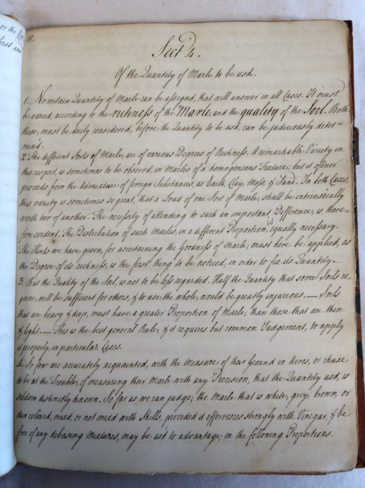

While working on my dissertation on the history of chemistry, I photographed
several thousand pages of handwritten lecture notes. The page above is on the
proper use of marles, a broad category of calcium-rich fertilizers used in
eighteenth-century agriculture.

Most of the notes I photographed are in similarly polished cursive handwriting.
Students would take notes during class in shorthand and then write up cleaner
copies as a way of reviewing and internalizing the material. Some students paid
a scribe to produce the clean copy, or simply bought a full set of lecture notes
from a scribe who had retained a copy from prior work with other students.

When I took these photos in 2011 and 2012, there were no computer programs that
could accurately transcribe this type of cursive. Those of us who are old enough
to have been taught cursive in school can read a page like this accurately
enough, but it is slow going. I read and transcribed sections that seemed
important for my research in eighteenth-century chemistry, but it was too time
consuming to read and transcribe all of the pages from all of the note sets I
photographed.

Today, I asked Claude to transcribe a page. It not only gave me a clean,
accurate transcription, it also asked whether I wanted TEI XML markup added to
the transcript. TEI is the sort of documentation researchers use when studying
manuscripts to capture details about word choice, page layout, and variance
between multiple copies.

While I was at it, I asked Claude to make a lightweight web app that would
display the image and TEI XML transcript side by side and allow me to make and
save changes. That took less than five minutes to produce and test.

For about $10 in Claude tokens, I can get transcripts of a 300-page lecture set
and share them as a website if I want to.

These lectures were delivered by Professors William Cullen and Joseph Black in
the second half of the eighteenth century, and they shaped the understanding of
chemistry throughout Britain and America for about fifty years. They have never
been published.

All that is left to do now is see whether Claude can help me convince people to
enroll in a 280-year-old chemistry course.
